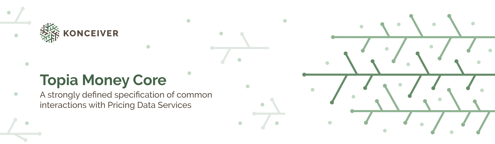

# Topia Money Core

<p align="center"></p>

> A strongly defined specification of common interactions with Cryptocurrency Data Services.

[](https://packagist.org/packages/konceiver/topia-money)
[](https://packagist.org/packages/konceiver/topia-money)
[](https://github.com/konceiver/topia-money/actions?query=workflow%3Arun-tests+branch%3Amaster)
[](https://codeclimate.com/github/konceiver/topia-money)
[](https://codeclimate.com/github/konceiver/topia-money)
[](https://packagist.org/packages/konceiver/topia-money)

This package was created by, and is maintained by [Brian Faust](https://github.com/faustbrian), and provides a sane way of getting historical data from Cryptocurrency Data Services.

## About

There are hundreds of services that provide historical data for crypto currencies but if you want to index that data you need to take care of a lot of normalisation. Topia.Money tries to abstract away this work by providing standardises Services and DTOs that will provide you with the information that matters and cut out the tedious work of data aggregation and post-processing.

## Services

| Symbol             | Meaning                               |
| ------------------ | ------------------------------------- |
| :white_check_mark: | The feature is fully implemented.     |
| :warning:          | The feature is partially implemented. |
| :x:                | The feature is not implemented.       |

| Service               | Symbols            | Historical         | Rate               |
| --------------------- | ------------------ | ------------------ | ------------------ |
| Altilly               | :white_check_mark: | :white_check_mark: | :white_check_mark: |
| Binance               | :white_check_mark: | :warning:          | :white_check_mark: |
| Bitfinex              | :white_check_mark: | :white_check_mark: | :white_check_mark: |
| BitMEX                | :white_check_mark: | :warning:          | :white_check_mark: |
| Bitstamp              | :white_check_mark: | :white_check_mark: | :white_check_mark: |
| Bittrex               | :white_check_mark: | :white_check_mark: | :white_check_mark: |
| Bitvavo               | :white_check_mark: | :warning:          | :white_check_mark: |
| Coinbase Pro          | :white_check_mark: | :white_check_mark: | :white_check_mark: |
| CoinCap               | :white_check_mark: | :x:                | :white_check_mark: |
| CoinGecko             | :white_check_mark: | :white_check_mark: | :white_check_mark: |
| CoinMarketCap         | :white_check_mark: | :x:                | :x:                |
| CryptoCompare         | :white_check_mark: | :white_check_mark: | :white_check_mark: |
| European Central Bank | :white_check_mark: | :warning:          | :warning:          |
| Exchange Rates API    | :white_check_mark: | :white_check_mark: | :white_check_mark: |
| Fixer                 | :white_check_mark: | :white_check_mark: | :white_check_mark: |
| Frankfurter           | :white_check_mark: | :white_check_mark: | :white_check_mark: |
| Gemini                | :white_check_mark: | :white_check_mark: | :white_check_mark: |
| Graviex               | :white_check_mark: | :white_check_mark: | :white_check_mark: |
| HitBTC                | :white_check_mark: | :white_check_mark: | :white_check_mark: |
| Kraken                | :white_check_mark: | :white_check_mark: | :white_check_mark: |
| OKCoin                | :white_check_mark: | :white_check_mark: | :white_check_mark: |
| OKEx                  | :white_check_mark: | :white_check_mark: | :white_check_mark: |
| Poloniex              | :white_check_mark: | :white_check_mark: | :white_check_mark: |
| VCC                   | :white_check_mark: | :x:                | :white_check_mark: |

## Installation

```bash
composer require konceiver/topia-money
```

## Usage

Take a look at our [test suite](https://github.com/faustbrian/topia-money/tree/master/tests) to see some usage examples.

## Testing

``` bash
composer test
```

## Changelog

Please see [CHANGELOG](CHANGELOG.md) for more information on what has changed recently.

## Contributing

Please see [CONTRIBUTING](CONTRIBUTING.md) for details.

## Security

If you discover a security vulnerability within this package, please send an e-mail to security@konceiver.dev. All security vulnerabilities will be promptly addressed.

## Credits

This project exists thanks to all the people who [contribute](../../contributors).

## Support Us

We invest a lot of resources into creating and maintaining our packages. You can support us and the development through [GitHub Sponsors](https://github.com/sponsors/faustbrian).

## License

Topia Money Core is an open-sourced software licensed under the [GNU AGPLv3](LICENSE).
